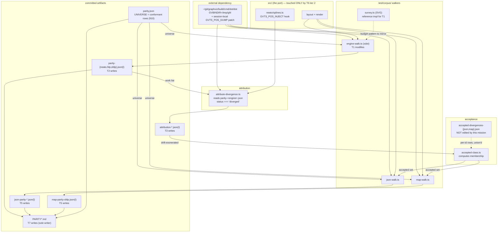

<!-- SPDX-License-Identifier: EPL-2.0 -->
# Component map — harnesses, artifacts, and who writes what

## The two facts this map exists to make obvious

1. **`parity.json` is the universe for every walker.** It defines which ids each
   track even attempts (`verdict === 'conformant'`, currently 910). That is why
   the 3 target ids were missing from the xdot tracks, and why clearing `1652`
   in PR #37 pulled it into every other track's backlog.
2. **`attribute-divergence.ts` reads `parity-<engine>.json`, not the json track.**
   Attribution is driven entirely by the **xdot** surface. Everything json/map
   accepts is inherited from that surface — which is precisely why D3 requires
   T4 to verify the transfer rather than assume it.

## Write-set ownership (no two tasks share a file)

| Artifact | Owner |
|---|---|
| `engine-walk.ts`, `engine-walk.test.ts` | T1 |
| `parity-{neato,fdp,sfdp}.json(l)` | T2 |
| `attribution-{neato,fdp,sfdp}.json(l)` | T3 |
| `evidence/json-transfer.md` | T4 |
| `json-parity-*.json(l)`, `map-parity-sfdp.json(l)` | T5 |
| `src/**` or `test/corpus/**` (conditional) | T6 |
| `PARITY*.md` | T7 |
| `accepted-divergences-{json,map}.json` | **nobody** — editing these is a stop |
