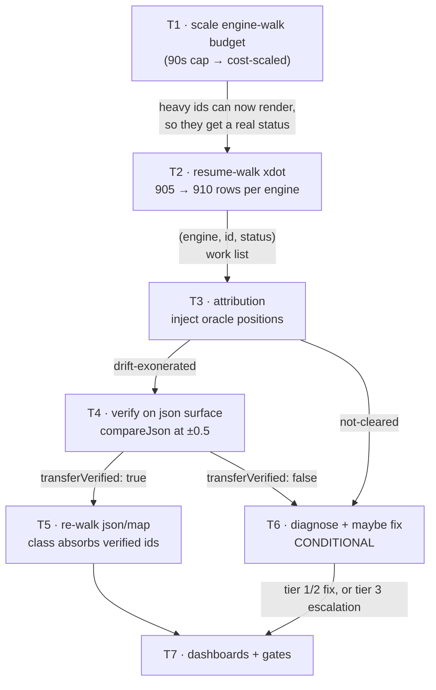
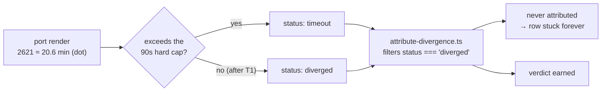
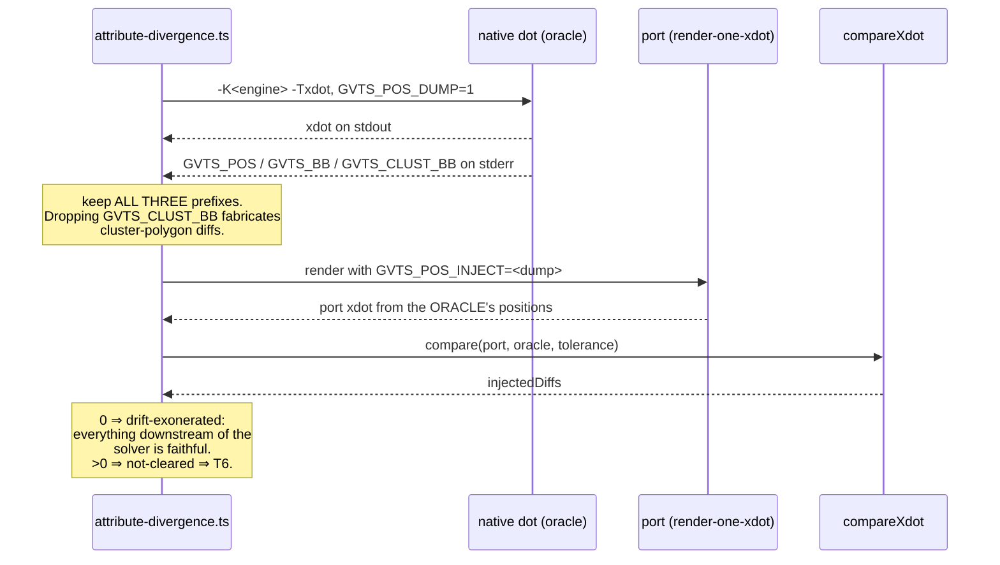

<!-- SPDX-License-Identifier: EPL-2.0 -->
# Data flow — how a diverged row earns a verdict

## The dependency chain this mission executes

## Why T1 gates everything

## The attribution experiment itself

T4 repeats this identical flow with `-Tjson` / `render-one-json.ts` /
`compareJson`, which is what turns inherited evidence into earned evidence.
