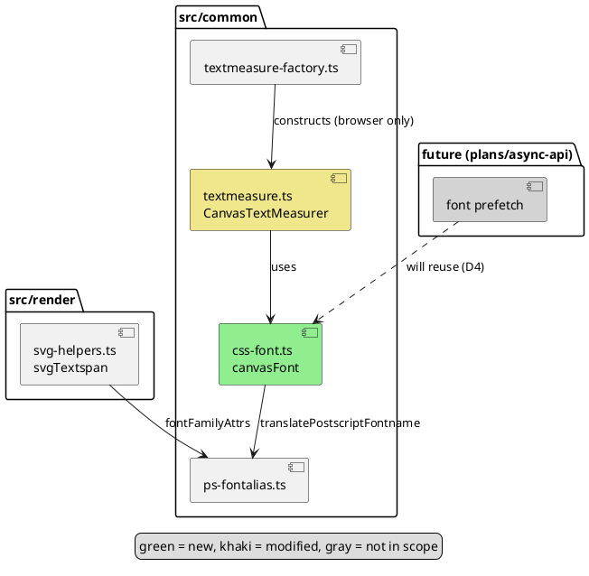

# Component map — touched components

```plantuml
@startuml
package "src/common" {
  [css-font.ts\ncanvasFont] as CF #lightgreen
  [textmeasure.ts\nCanvasTextMeasurer] as TM #khaki
  [ps-fontalias.ts] as PA
  [textmeasure-factory.ts] as FAC
}
package "src/render" {
  [svg-helpers.ts\nsvgTextspan] as SVG
}
package "future (plans/async-api)" {
  [font prefetch] as PRE #lightgray
}
TM --> CF : uses
CF --> PA : translatePostscriptFontname
SVG --> PA : fontFamilyAttrs
FAC --> TM : constructs (browser only)
PRE ..> CF : will reuse (D4)
legend
  green = new, khaki = modified, gray = not in scope
endlegend
@enduml
```
