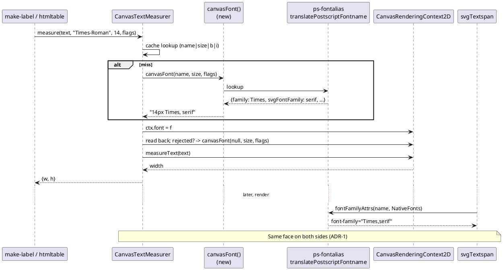

# Data flow — label measurement vs SVG emission (browser)

```plantuml
@startuml
participant "make-label / htmltable" as L
participant "CanvasTextMeasurer" as M
participant "canvasFont()\n(new)" as F
participant "ps-fontalias\ntranslatePostscriptFontname" as A
participant "CanvasRenderingContext2D" as C
participant "svgTextspan" as S

L -> M : measure(text, "Times-Roman", 14, flags)
M -> M : cache lookup (name|size|b|i)
alt miss
  M -> F : canvasFont(name, size, flags)
  F -> A : lookup
  A --> F : {family: Times, svgFontFamily: serif, ...}
  F --> M : "14px Times, serif"
end
M -> C : ctx.font = f
M -> C : read back; rejected? -> canvasFont(null, size, flags)
M -> C : measureText(text)
C --> M : width
M --> L : {w, h}
...later, render...
S -> A : fontFamilyAttrs(name, NativeFonts)
A --> S : font-family="Times,serif"
note over M,S : Same face on both sides (ADR-1)
@enduml
```
