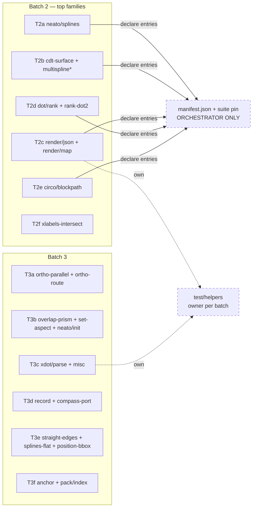

<!-- SPDX-License-Identifier: EPL-2.0 -->

# Family → module map

```mermaid
graph LR
    subgraph batch2 [Batch 2 — top families]
        A[T2a neato/splines]
        B[T2b cdt-surface + multispline*]
        C[T2c render/json + render/map]
        D[T2d dot/rank + rank-dot2]
        E[T2e circo/blockpath]
        F[T2f xlabels-intersect]
    end
    subgraph batch3 [Batch 3]
        G[T3a ortho-parallel + ortho-route]
        H[T3b overlap-prism + set-aspect + neato/init]
        I[T3c xdot/parse + misc]
        J[T3d record + compass-port]
        K[T3e straight-edges + splines-flat + position-bbox]
        L[T3f anchor + pack/index]
    end
    M[manifest.json + suite pin<br/>ORCHESTRATOR ONLY]:::shared
    N[test/helpers<br/>owner per batch]:::shared
    A & B & C & D & E -->|declare entries| M
    C & I -.own.-> N
    classDef shared stroke-dasharray: 5 5
```
