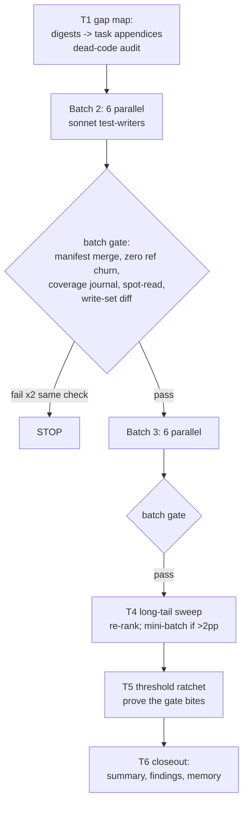

<!-- SPDX-License-Identifier: EPL-2.0 -->

# Batch loop

```mermaid
flowchart TD
    T1[T1 gap map:<br/>digests -> task appendices<br/>dead-code audit] --> B2[Batch 2: 6 parallel<br/>sonnet test-writers]
    B2 --> G2{batch gate:<br/>manifest merge, zero ref churn,<br/>coverage journal, spot-read,<br/>write-set diff}
    G2 -- fail x2 same check --> STOP[STOP]
    G2 -- pass --> B3[Batch 3: 6 parallel]
    B3 --> G3{batch gate}
    G3 -- pass --> T4[T4 long-tail sweep<br/>re-rank; mini-batch if >2pp]
    T4 --> T5[T5 threshold ratchet<br/>prove the gate bites]
    T5 --> T6[T6 closeout:<br/>summary, findings, memory]
```
