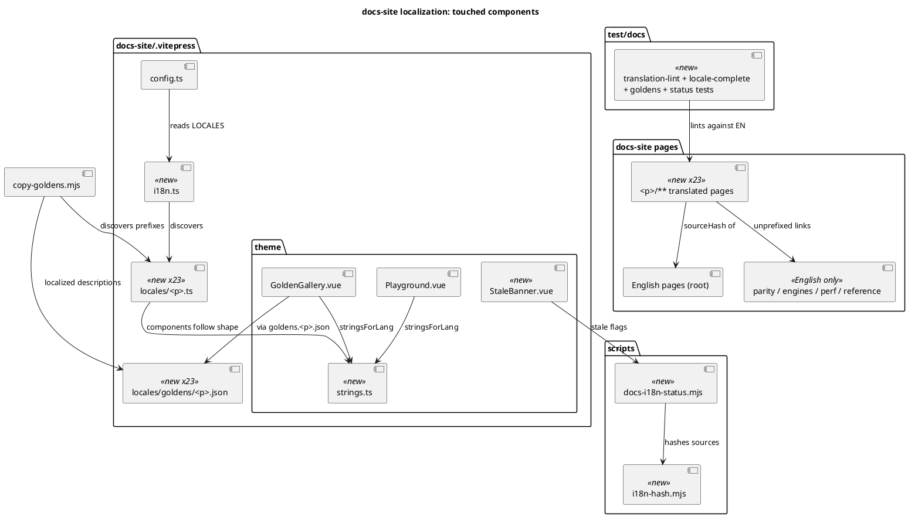

<!-- SPDX-License-Identifier: EPL-2.0 -->
# Component map — what the mission touches

```plantuml
@startuml
title docs-site localization: touched components
package "docs-site/.vitepress" {
  [config.ts] as CFG
  [i18n.ts] as REG <<new>>
  [locales/<p>.ts] as LOC <<new x23>>
  [locales/goldens/<p>.json] as GJ <<new x23>>
  package theme {
    [strings.ts] as STR <<new>>
    [Playground.vue] as PG
    [GoldenGallery.vue] as GG
    [StaleBanner.vue] as SB <<new>>
  }
}
package "docs-site pages" {
  [English pages (root)] as EN
  [<p>/** translated pages] as TR <<new x23>>
  [parity / engines / perf / reference] as GEN <<English only>>
}
[copy-goldens.mjs] as CG
package scripts {
  [i18n-hash.mjs] as HASH <<new>>
  [docs-i18n-status.mjs] as STAT <<new>>
}
package "test/docs" {
  [translation-lint + locale-complete\n+ goldens + status tests] as T <<new>>
}

CFG --> REG : reads LOCALES
REG --> LOC : discovers
LOC --> STR : components follow shape
PG --> STR : stringsForLang
GG --> STR : stringsForLang
CG --> LOC : discovers prefixes
CG --> GJ : localized descriptions
GG --> GJ : via goldens.<p>.json
TR --> EN : sourceHash of
STAT --> HASH : hashes sources
SB --> STAT : stale flags
TR --> GEN : unprefixed links
T --> TR : lints against EN
@enduml
```
