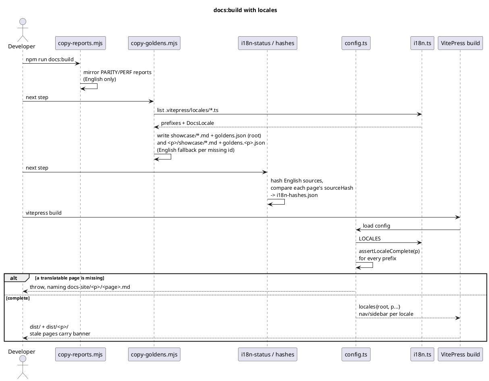

<!-- SPDX-License-Identifier: EPL-2.0 -->
# Data flow — `npm run docs:build` after the mission

```plantuml
@startuml
title docs:build with locales
actor Developer
participant "copy-reports.mjs" as CR
participant "copy-goldens.mjs" as CG
participant "i18n-status / hashes" as ST
participant "config.ts" as CFG
participant "i18n.ts" as REG
participant "VitePress build" as VP

Developer -> CR : npm run docs:build
CR -> CR : mirror PARITY/PERF reports\n(English only)
Developer -> CG : next step
CG -> REG : list .vitepress/locales/*.ts
REG --> CG : prefixes + DocsLocale
CG -> CG : write showcase/*.md + goldens.json (root)\nand <p>/showcase/*.md + goldens.<p>.json\n(English fallback per missing id)
Developer -> ST : next step
ST -> ST : hash English sources,\ncompare each page's sourceHash\n-> i18n-hashes.json
Developer -> VP : vitepress build
VP -> CFG : load config
CFG -> REG : LOCALES
CFG -> CFG : assertLocaleComplete(p)\nfor every prefix
alt a translatable page is missing
  CFG --> Developer : throw, naming docs-site/<p>/<page>.md
else complete
  CFG --> VP : locales{root, p...}\nnav/sidebar per locale
  VP --> Developer : dist/ + dist/<p>/\nstale pages carry banner
end
@enduml
```
