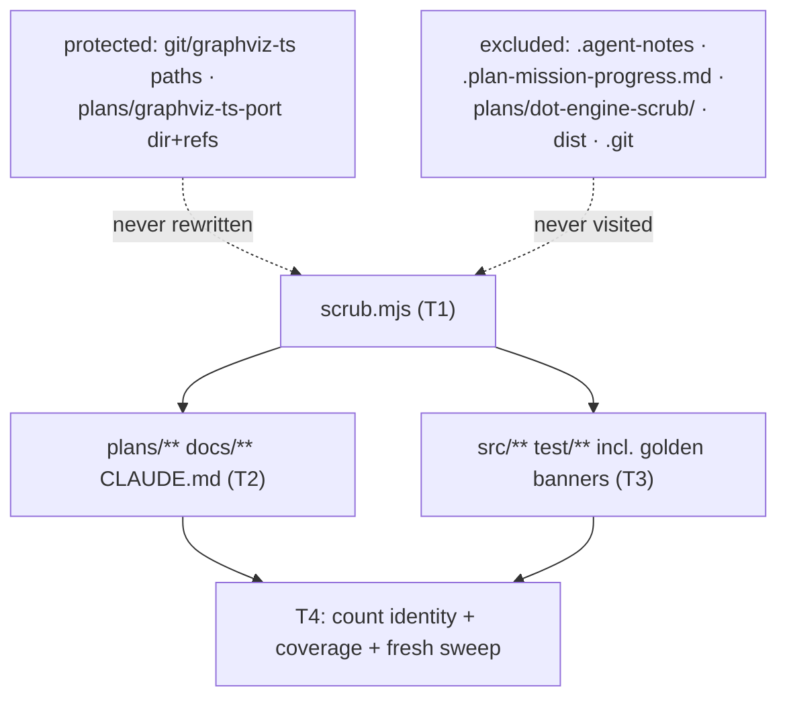

<!-- SPDX-License-Identifier: EPL-2.0 -->

# Component map — scrub vs protect

```mermaid
graph TD
    SCRUB["scrub.mjs (T1)"]
    T2SET["plans/** docs/** CLAUDE.md (T2)"]
    T3SET["src/** test/** incl. golden banners (T3)"]
    PROT["protected: git/graphviz-ts paths ·<br/>plans/graphviz-ts-port dir+refs"]
    EXCL["excluded: .agent-notes ·<br/>.plan-mission-progress.md ·<br/>plans/dot-engine-scrub/ · dist · .git"]
    GATE["T4: count identity + coverage + fresh sweep"]

    SCRUB --> T2SET --> GATE
    SCRUB --> T3SET --> GATE
    PROT -.never rewritten.-> SCRUB
    EXCL -.never visited.-> SCRUB
```
