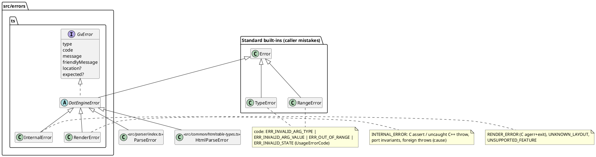
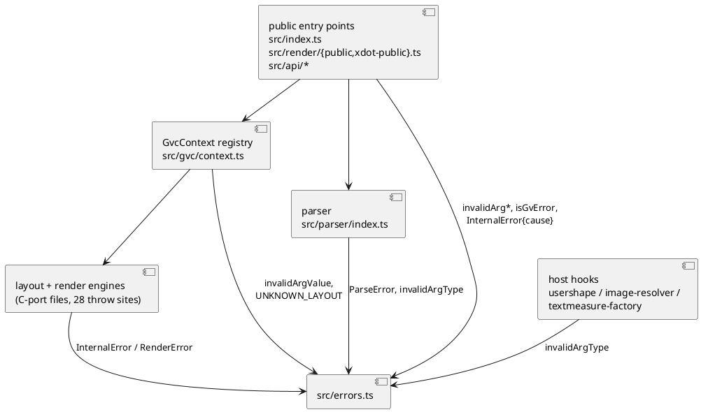

# Component map: error hierarchy

Classes and where they are thrown after the mission. Usage errors are standard
built-ins carrying a `code`; they are deliberately outside `DotEngineError`.

```plantuml
@startuml
skinparam classAttributeIconSize 0
hide empty members

package "Standard built-ins (caller mistakes)" {
  class Error
  class TypeError
  class RangeError
}
note "code: ERR_INVALID_ARG_TYPE |\nERR_INVALID_ARG_VALUE | ERR_OUT_OF_RANGE |\nERR_INVALID_STATE (UsageErrorCode)" as UN

package "src/errors.ts" {
  interface GvError {
    type
    code
    message
    friendlyMessage
    location?
    expected?
  }
  abstract class DotEngineError
  class InternalError
  class RenderError
}
class ParseError <<src/parser/index.ts>>
class HtmlParseError <<src/common/htmltable-types.ts>>

Error <|-- TypeError
Error <|-- RangeError
Error <|-- DotEngineError
GvError <|.. DotEngineError
DotEngineError <|-- ParseError
DotEngineError <|-- HtmlParseError
DotEngineError <|-- RenderError
DotEngineError <|-- InternalError
TypeError .. UN
RangeError .. UN

note right of InternalError
  INTERNAL_ERROR: C assert / uncaught C++ throw,
  port invariants, foreign throws (cause)
end note
note right of RenderError
  RENDER_ERROR (C agerr+exit), UNKNOWN_LAYOUT,
  UNSUPPORTED_FEATURE
end note
@enduml
```

```plantuml
@startuml
component "public entry points\nsrc/index.ts\nsrc/render/{public,xdot-public}.ts\nsrc/api/*" as Entry
component "GvcContext registry\nsrc/gvc/context.ts" as Ctx
component "parser\nsrc/parser/index.ts" as Parser
component "layout + render engines\n(C-port files, 28 throw sites)" as Engines
component "host hooks\nusershape / image-resolver /\ntextmeasure-factory" as Hooks
component "src/errors.ts" as Errors

Entry --> Errors : invalidArg*, isGvError,\nInternalError{cause}
Ctx --> Errors : invalidArgValue,\nUNKNOWN_LAYOUT
Parser --> Errors : ParseError, invalidArgType
Engines --> Errors : InternalError / RenderError
Hooks --> Errors : invalidArgType
Entry --> Parser
Entry --> Ctx
Ctx --> Engines
@enduml
```
