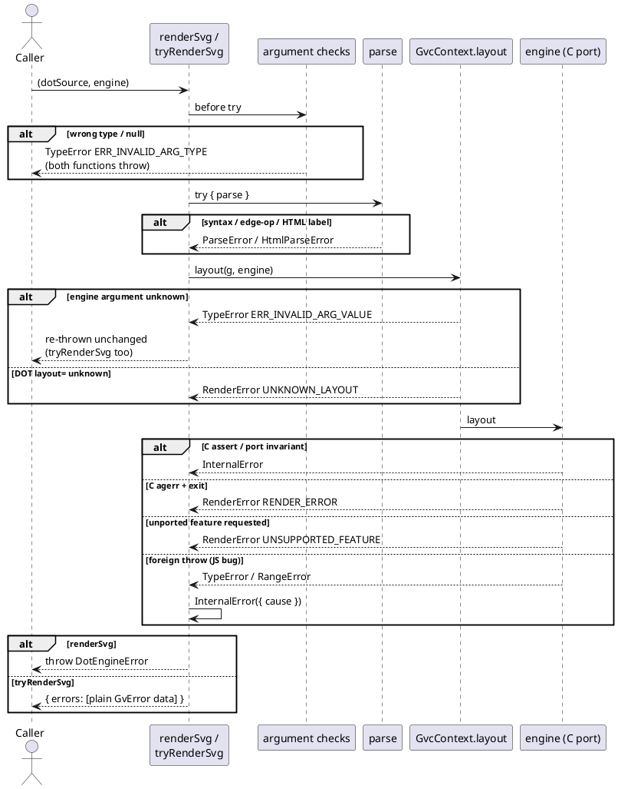

# Data flow: how a failure reaches the caller

```plantuml
@startuml
actor Caller
participant "renderSvg /\ntryRenderSvg" as API
participant "argument checks" as Chk
participant "parse" as P
participant "GvcContext.layout" as Ctx
participant "engine (C port)" as Eng

Caller -> API : (dotSource, engine)
API -> Chk : before try
alt wrong type / null
  Chk --> Caller : TypeError ERR_INVALID_ARG_TYPE\n(both functions throw)
end
API -> P : try { parse }
alt syntax / edge-op / HTML label
  P --> API : ParseError / HtmlParseError
end
API -> Ctx : layout(g, engine)
alt engine argument unknown
  Ctx --> API : TypeError ERR_INVALID_ARG_VALUE
  API --> Caller : re-thrown unchanged\n(tryRenderSvg too)
else DOT layout= unknown
  Ctx --> API : RenderError UNKNOWN_LAYOUT
end
Ctx -> Eng : layout
alt C assert / port invariant
  Eng --> API : InternalError
else C agerr + exit
  Eng --> API : RenderError RENDER_ERROR
else unported feature requested
  Eng --> API : RenderError UNSUPPORTED_FEATURE
else foreign throw (JS bug)
  Eng --> API : TypeError / RangeError
  API -> API : InternalError({ cause })
end
alt renderSvg
  API --> Caller : throw DotEngineError
else tryRenderSvg
  API --> Caller : { errors: [plain GvError data] }
end
@enduml
```
