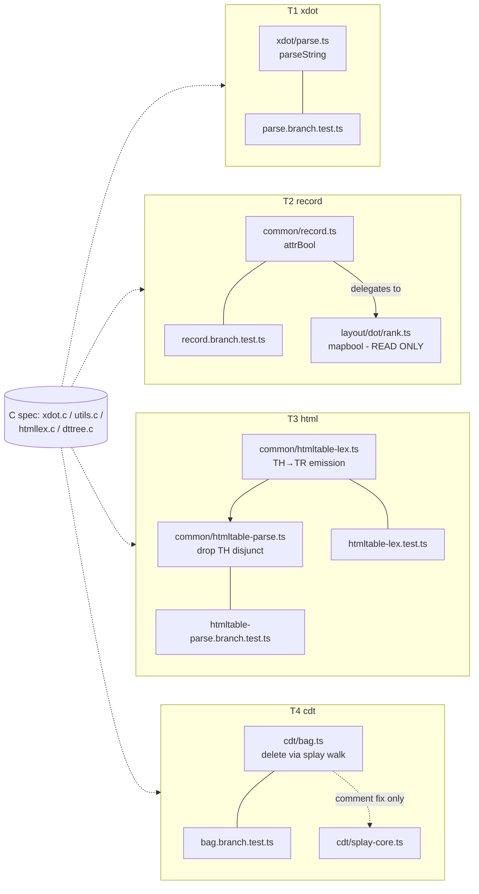

<!-- SPDX-License-Identifier: EPL-2.0 -->

# Component map — files touched per task

```mermaid
graph LR
  subgraph T1 [T1 xdot]
    P[xdot/parse.ts<br/>parseString] --- PT[parse.branch.test.ts]
  end
  subgraph T2 [T2 record]
    R[common/record.ts<br/>attrBool] --- RT[record.branch.test.ts]
    R -->|delegates to| M[layout/dot/rank.ts<br/>mapbool - READ ONLY]
  end
  subgraph T3 [T3 html]
    L[common/htmltable-lex.ts<br/>TH→TR emission] --> HP[common/htmltable-parse.ts<br/>drop TH disjunct]
    L --- LT[htmltable-lex.test.ts]
    HP --- HPT[htmltable-parse.branch.test.ts]
  end
  subgraph T4 [T4 cdt]
    B[cdt/bag.ts<br/>delete via splay walk] --- BT[bag.branch.test.ts]
    B -.->|comment fix only| S[cdt/splay-core.ts]
  end
  C[(C spec: xdot.c / utils.c /<br/>htmllex.c / dttree.c)] -.-> T1 & T2 & T3 & T4
```

Write-sets are disjoint; `rank.ts` is read-only for T2 (import only).
