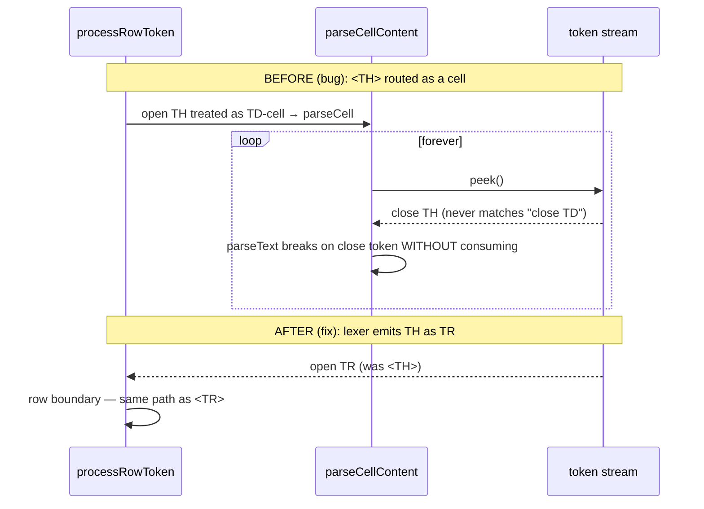

<!-- SPDX-License-Identifier: EPL-2.0 -->

# Data flow — the T3 hang mechanism (before/after)

T1/T2/T4 have no multi-component flow: each is a single-function behavior fix
(parseString early-null; attrBool → mapbool; DtBag.delete splay walk).
