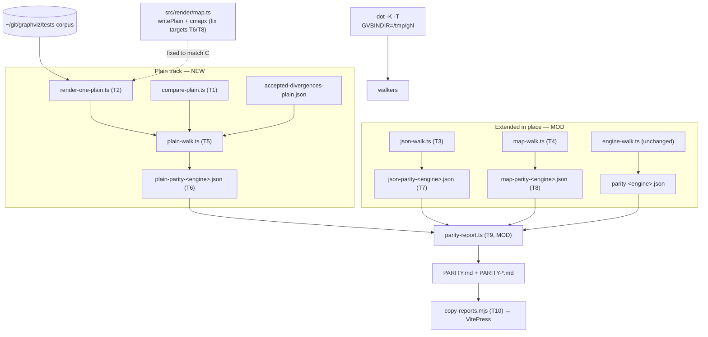

<!-- SPDX-License-Identifier: EPL-2.0 -->

# Component map

How the new plain track slots into the existing per-track harness. Boxes marked
NEW are created; MOD are modified; the rest exist.

```mermaid
graph TD
  corpus[("~/git/graphviz/tests corpus")] --> renderOne
  oracleBin["dot -K<engine> -T<fmt><br/>GVBINDIR=/tmp/ghl"] --> walkers

  subgraph new [Plain track — NEW]
    renderOne["render-one-plain.ts (T2)"] --> plainWalk["plain-walk.ts (T5)"]
    comparePlain["compare-plain.ts (T1)"] --> plainWalk
    plainWalk --> plainJson["plain-parity-&lt;engine&gt;.json (T6)"]
    acceptPlain["accepted-divergences-plain.json"] --> plainWalk
  end

  subgraph existing [Extended in place — MOD]
    jsonWalk["json-walk.ts (T3)"] --> jsonJson["json-parity-&lt;engine&gt;.json (T7)"]
    mapWalk["map-walk.ts (T4)"] --> mapJson["map-parity-&lt;engine&gt;.json (T8)"]
    engineWalk["engine-walk.ts (unchanged)"] --> xdotJson["parity-&lt;engine&gt;.json"]
  end

  plainJson --> report["parity-report.ts (T9, MOD)"]
  jsonJson --> report
  mapJson --> report
  xdotJson --> report
  report --> PARITY["PARITY.md + PARITY-*.md"]
  PARITY --> copy["copy-reports.mjs (T10) → VitePress"]

  srcMap["src/render/map.ts<br/>writePlain + cmapx (fix targets T6/T8)"] -.->|fixed to match C| renderOne
```
