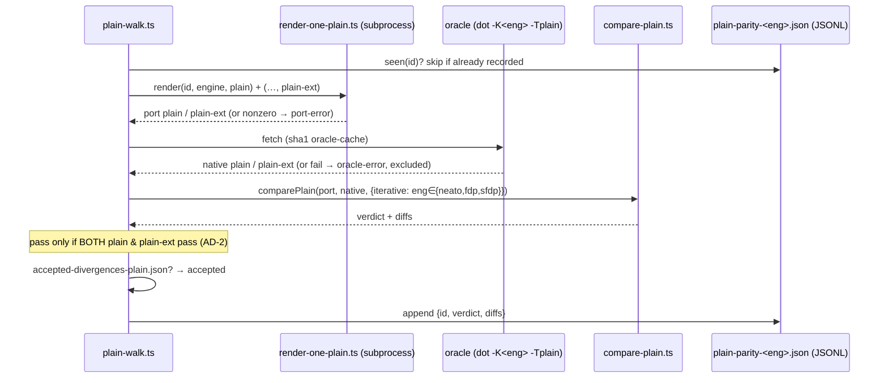
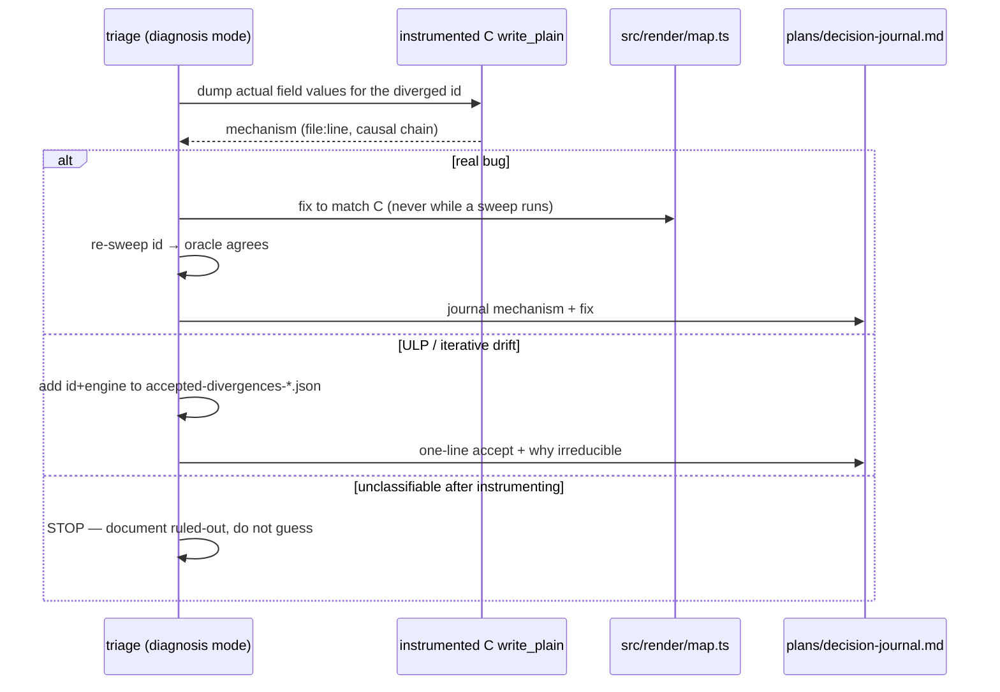

<!-- SPDX-License-Identifier: EPL-2.0 -->

# Data flow — one plain-walk item

Per corpus id, per engine. Deterministic vs iterative branch is AD-4.

```mermaid
sequenceDiagram
  participant W as plain-walk.ts
  participant P as render-one-plain.ts (subprocess)
  participant O as oracle (dot -K<eng> -Tplain)
  participant C as compare-plain.ts
  participant J as plain-parity-<eng>.json (JSONL)

  W->>J: seen(id)? skip if already recorded
  W->>P: render(id, engine, plain) + (…, plain-ext)
  P-->>W: port plain / plain-ext  (or nonzero → port-error)
  W->>O: fetch (sha1 oracle-cache)
  O-->>W: native plain / plain-ext  (or fail → oracle-error, excluded)
  W->>C: comparePlain(port, native, {iterative: eng∈{neato,fdp,sfdp}})
  C-->>W: verdict + diffs
  Note over W: pass only if BOTH plain & plain-ext pass (AD-2)
  W->>W: accepted-divergences-plain.json? → accepted
  W->>J: append {id, verdict, diffs}
```

## Triage loop (T6/T7/T8) per diverged item

```mermaid
sequenceDiagram
  participant T as triage (diagnosis mode)
  participant GC as instrumented C write_plain
  participant S as src/render/map.ts
  participant JR as plans/decision-journal.md

  T->>GC: dump actual field values for the diverged id
  GC-->>T: mechanism (file:line, causal chain)
  alt real bug
    T->>S: fix to match C  (never while a sweep runs)
    T->>T: re-sweep id → oracle agrees
    T->>JR: journal mechanism + fix
  else ULP / iterative drift
    T->>T: add id+engine to accepted-divergences-*.json
    T->>JR: one-line accept + why irreducible
  else unclassifiable after instrumenting
    T->>T: STOP — document ruled-out, do not guess
  end
```
