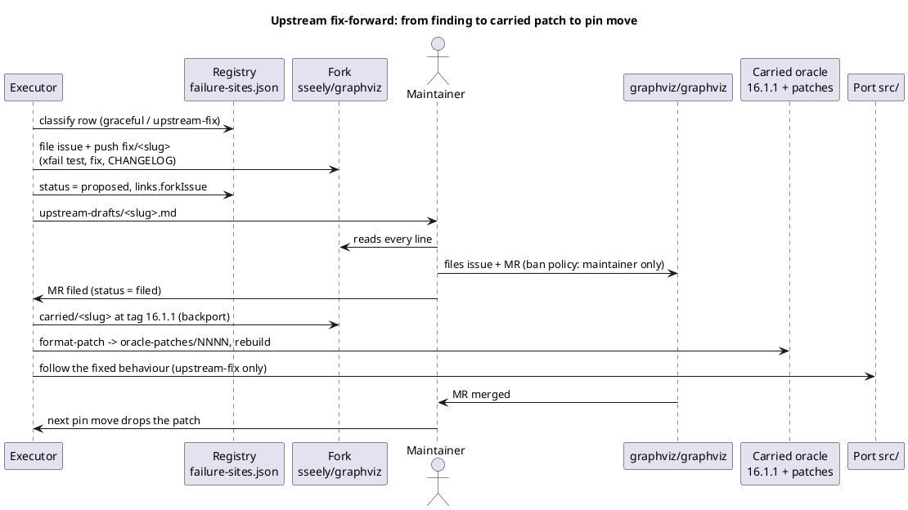
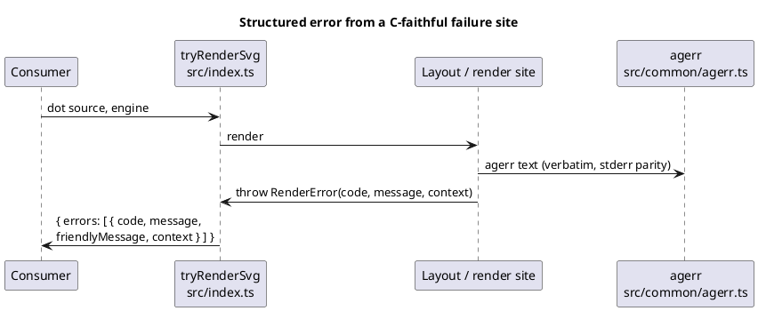

<!-- SPDX-License-Identifier: EPL-2.0 -->
# Data flow

## A C defect's life cycle (D2, D6, D7)

```plantuml
@startuml
title Upstream fix-forward: from finding to carried patch to pin move
participant "Executor" as X
participant "Registry\nfailure-sites.json" as R
participant "Fork\nsseely/graphviz" as F
actor "Maintainer" as M
participant "graphviz/graphviz" as U
participant "Carried oracle\n16.1.1 + patches" as O
participant "Port src/" as P

X -> R : classify row (graceful / upstream-fix)
X -> F : file issue + push fix/<slug>\n(xfail test, fix, CHANGELOG)
X -> R : status = proposed, links.forkIssue
X -> M : upstream-drafts/<slug>.md
M -> F : reads every line
M -> U : files issue + MR (ban policy: maintainer only)
M -> X : MR filed (status = filed)
X -> F : carried/<slug> at tag 16.1.1 (backport)
X -> O : format-patch -> oracle-patches/NNNN, rebuild
X -> P : follow the fixed behaviour (upstream-fix only)
U -> M : MR merged
M -> X : next pin move drops the patch
@enduml
```

## A mirror site at render time (D3, D4)

```plantuml
@startuml
title Structured error from a C-faithful failure site
participant "Consumer" as C
participant "tryRenderSvg\nsrc/index.ts" as T
participant "Layout / render site" as S
participant "agerr\nsrc/common/agerr.ts" as A

C -> T : dot source, engine
T -> S : render
S -> A : agerr text (verbatim, stderr parity)
S -> T : throw RenderError(code, message, context)
T -> C : { errors: [ { code, message,\nfriendlyMessage, context } ] }
@enduml
```
