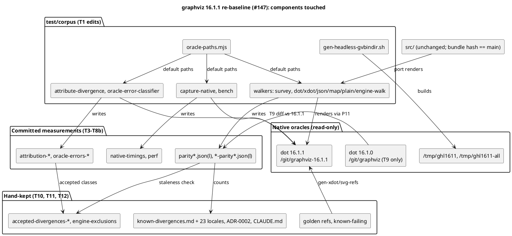

# Component map — what the re-baseline touches

```plantuml
@startuml
skinparam componentStyle rectangle
title graphviz 16.1.1 re-baseline (#147): components touched

package "Native oracles (read-only)" {
  [dot 16.1.1\n~/git/graphviz-16.1.1] as N11
  [dot 16.1.0\n~/git/graphviz (T9 only)] as N10
  [/tmp/ghl1611, /tmp/ghl1611-all] as P11
}
package "test/corpus (T1 edits)" {
  [oracle-paths.mjs] as OP
  [gen-headless-gvbindir.sh] as GH
  [walkers: survey, dot/xdot/json/map/plain/engine-walk] as W
  [attribute-divergence, oracle-error-classifier] as A
  [capture-native, bench] as T
}
package "Committed measurements (T3–T8b)" {
  [parity*.json(l), *-parity*.json(l)] as R
  [attribution-*, oracle-errors-*] as RA
  [native-timings, perf] as RT
}
package "Hand-kept (T10, T11, T12)" {
  [accepted-divergences-*, engine-exclusions] as H
  [golden refs, known-failing] as G
  [known-divergences.md + 23 locales, ADR-0002, CLAUDE.md] as D
}
[src/ (unchanged; bundle hash == main)] as SRC

GH --> P11 : builds
OP --> W : default paths
OP --> A : default paths
OP --> T : default paths
W --> N11 : renders via P11
A --> N11
T --> N11
W --> R : writes
A --> RA : writes
T --> RT : writes
SRC --> W : port renders
R --> H : staleness check
RA --> H : accepted classes
R --> D : counts
G --> N11 : gen-xdot/svg-refs
N10 --> R : T9 diff vs 16.1.1
@enduml
```
