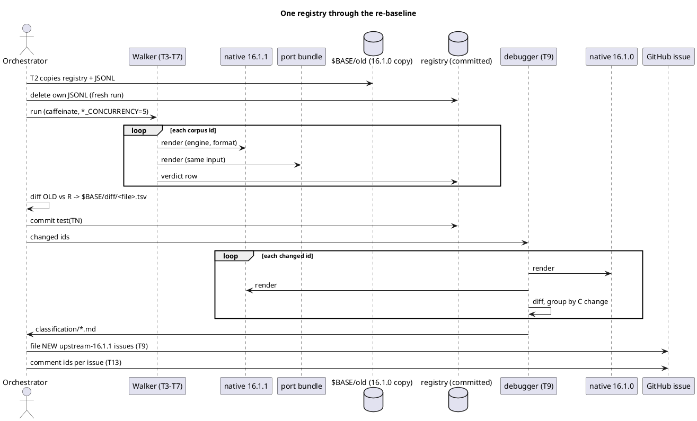

# Data flow — from a fresh walk to an issue comment

```plantuml
@startuml
title One registry through the re-baseline
actor Orchestrator as O
participant "Walker (T3–T7)" as W
participant "native 16.1.1" as N11
participant "port bundle" as P
database "$BASE/old (16.1.0 copy)" as OLD
database "registry (committed)" as R
participant "debugger (T9)" as D
participant "native 16.1.0" as N10
participant "GitHub issue" as I

O -> OLD : T2 copies registry + JSONL
O -> R : delete own JSONL (fresh run)
O -> W : run (caffeinate, *_CONCURRENCY=5)
loop each corpus id
  W -> N11 : render (engine, format)
  W -> P : render (same input)
  W -> R : verdict row
end
O -> O : diff OLD vs R -> $BASE/diff/<file>.tsv
O -> R : commit test(TN)
O -> D : changed ids
loop each changed id
  D -> N10 : render
  D -> N11 : render
  D -> D : diff, group by C change
end
D -> O : classification/*.md
O -> I : file NEW upstream-16.1.1 issues (T9)
O -> I : comment ids per issue (T13)
@enduml
```
