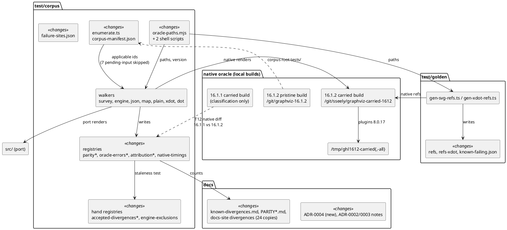

# Component map — what #297 touches

Shaded components change; `src/` is read-only (bundle hash proves it).

```plantuml
@startuml
skinparam componentStyle rectangle
skinparam rectangle<<changes>> {
  BackgroundColor #FFF2CC
}

package "native oracle (local builds)" {
  [16.1.2 carried build\n~/git/sseely/graphviz-carried-1612] as C12
  [16.1.2 pristine build\n~/git/graphviz-16.1.2] as P12
  [16.1.1 carried build\n(classification only)] as C11
  [/tmp/ghl1612-carried{,-all}] as D12
}

package "test/corpus" {
  [oracle-paths.mjs\n+ 2 shell scripts] <<changes>> as OP
  [enumerate.ts\ncorpus-manifest.json] <<changes>> as EN
  [walkers\nsurvey, engine, json, map, plain, xdot, dot] as W
  [registries\nparity*, oracle-errors*, attribution*, native-timings] <<changes>> as R
  [hand registries\naccepted-divergences*, engine-exclusions] <<changes>> as H
  [failure-sites.json] <<changes>> as FS
}

package "test/golden" {
  [gen-svg-refs.ts / gen-xdot-refs.ts] as G
  [refs, refs-xdot, known-failing.json] <<changes>> as GR
}

package docs {
  [ADR-0004 (new), ADR-0002/0003 notes] <<changes>> as ADR
  [known-divergences.md, PARITY*.md,\ndocs-site divergences (24 copies)] <<changes>> as KD
}

[src/ (port)] as SRC

OP --> W : paths, version
OP --> G : paths
EN --> W : applicable ids\n(7 pending-input skipped)
W --> C12 : native renders
C12 --> D12 : plugins 8.0.17
W --> SRC : port renders
W --> R : writes
R --> H : staleness test
G --> C12 : native refs
G --> GR : writes
C11 ..> R : T12 native diff\n16.1.1 vs 16.1.2
P12 ..> EN : corpus root tests/
R --> KD : counts
@enduml
```
