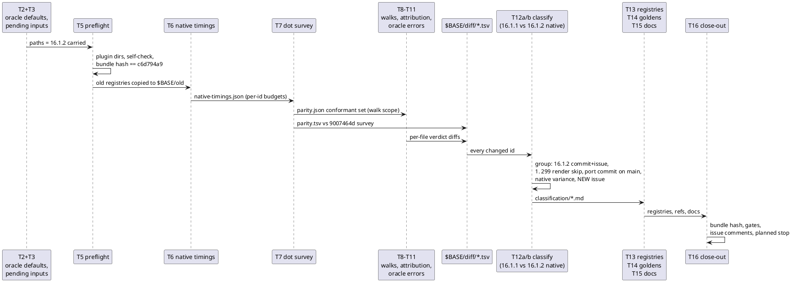

# Data flow — from oracle flip to classified changes

```plantuml
@startuml
participant "T2+T3\noracle defaults,\npending inputs" as T2
participant "T5 preflight" as T5
participant "T6 native timings" as T6
participant "T7 dot survey" as T7
participant "T8–T11\nwalks, attribution,\noracle errors" as W
participant "$BASE/diff/*.tsv" as D
participant "T12a/b classify\n(16.1.1 vs 16.1.2 native)" as C
participant "T13 registries\nT14 goldens\nT15 docs" as R
participant "T16 close-out" as T16

T2 -> T5 : paths = 16.1.2 carried
T5 -> T5 : plugin dirs, self-check,\nbundle hash == c6d794a9
T5 -> T6 : old registries copied to $BASE/old
T6 -> T7 : native-timings.json (per-id budgets)
T7 -> W : parity.json conformant set (walk scope)
T7 -> D : parity.tsv vs 9007464d survey
W -> D : per-file verdict diffs
D -> C : every changed id
C -> C : group: 16.1.2 commit+issue,\n#299 render skip, port commit on main,\nnative variance, NEW issue
C -> R : classification/*.md
R -> T16 : registries, refs, docs
T16 -> T16 : bundle hash, gates,\nissue comments, planned stop
@enduml
```
