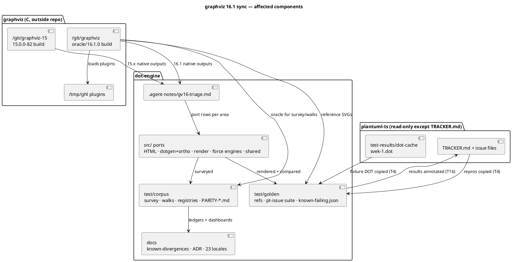

# Component map — what the 16.1 sync touches

```plantuml
@startuml
title graphviz 16.1 sync — affected components
package "graphviz (C, outside repo)" {
  [~/git/graphviz-15\n15.0.0-82 build] as GV15
  [~/git/graphviz\noracle/16.1.0 build] as GV16
  [/tmp/ghl plugins] as GHL
}
package "plantuml-ts (read-only except TRACKER.md)" {
  [TRACKER.md + issue files] as TRK
  [test-results/dot-cache\nsvek-1.dot] as CACHE
}
package "dot-engine" {
  [.agent-notes/gv16-triage.md] as TRI
  [src/ ports\nHTML · dotgen+ortho · render · force engines · shared] as SRC
  [test/golden\nrefs · pt-issue suite · known-failing.json] as GOLD
  [test/corpus\nsurvey · walks · registries · PARITY-*.md] as CORP
  [docs\nknown-divergences · ADR · 23 locales] as DOCS
}
GV16 --> GHL : loads plugins
GV15 --> TRI : 15.x native outputs
GV16 --> TRI : 16.1 native outputs
TRI --> SRC : port rows per area
TRK --> GOLD : repros copied (T4)
CACHE --> GOLD : fixture DOT copied (T4)
GV16 --> GOLD : reference SVGs
GV16 --> CORP : oracle for survey/walks
SRC --> GOLD : rendered + compared
SRC --> CORP : surveyed
CORP --> DOCS : ledgers + dashboards
GOLD --> TRK : results annotated (T16)
@enduml
```
