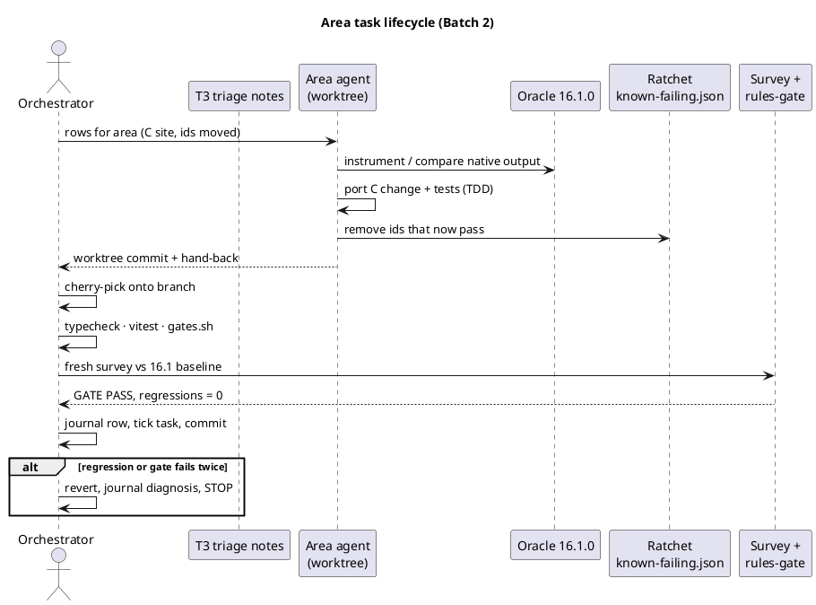
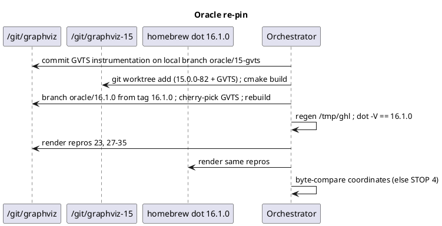

# Data flow — one area task from triage to landing

```plantuml
@startuml
title Area task lifecycle (Batch 2)
actor Orchestrator as O
participant "T3 triage notes" as T3
participant "Area agent\n(worktree)" as A
participant "Oracle 16.1.0" as N
participant "Ratchet\nknown-failing.json" as R
participant "Survey +\nrules-gate" as S
O -> A : rows for area (C site, ids moved)
A -> N : instrument / compare native output
A -> A : port C change + tests (TDD)
A -> R : remove ids that now pass
A --> O : worktree commit + hand-back
O -> O : cherry-pick onto branch
O -> O : typecheck · vitest · gates.sh
O -> S : fresh survey vs 16.1 baseline
S --> O : GATE PASS, regressions = 0
O -> O : journal row, tick task, commit
alt regression or gate fails twice
  O -> O : revert, journal diagnosis, STOP
end
@enduml
```

# Data flow — oracle re-pin (T0)

```plantuml
@startuml
title Oracle re-pin
participant "~/git/graphviz" as G
participant "~/git/graphviz-15" as G15
participant "homebrew dot 16.1.0" as H
participant Orchestrator as O
O -> G : commit GVTS instrumentation on local branch oracle/15-gvts
O -> G15 : git worktree add (15.0.0-82 + GVTS) ; cmake build
O -> G : branch oracle/16.1.0 from tag 16.1.0 ; cherry-pick GVTS ; rebuild
O -> O : regen /tmp/ghl ; dot -V == 16.1.0
O -> G : render repros 23, 27-35
O -> H : render same repros
O -> O : byte-compare coordinates (else STOP 4)
@enduml
```
