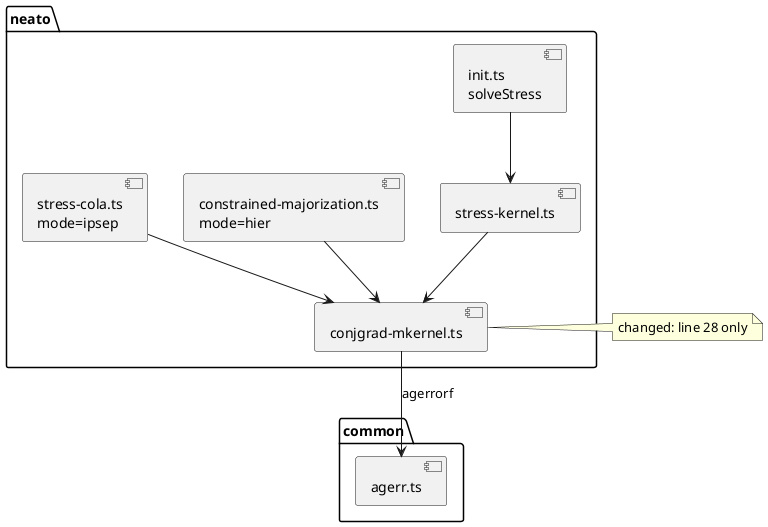

# Component map

```plantuml
@startuml
package "neato" {
  [init.ts\nsolveStress] --> [stress-kernel.ts]
  [constrained-majorization.ts\nmode=hier] --> [conjgrad-mkernel.ts]
  [stress-cola.ts\nmode=ipsep] --> [conjgrad-mkernel.ts]
  [stress-kernel.ts] --> [conjgrad-mkernel.ts]
}
package "common" {
  [agerr.ts]
}
[conjgrad-mkernel.ts] --> [agerr.ts] : agerrorf
note right of [conjgrad-mkernel.ts] : changed: line 28 only
@enduml
```
