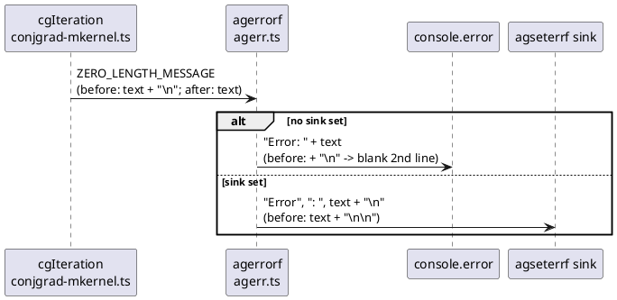

# Data flow: the zero-length message

```plantuml
@startuml
participant "cgIteration\nconjgrad-mkernel.ts" as cg
participant "agerrorf\nagerr.ts" as ag
participant "console.error" as con
participant "agseterrf sink" as sink

cg -> ag : ZERO_LENGTH_MESSAGE\n(before: text + "\\n"; after: text)
alt no sink set
  ag -> con : "Error: " + text\n(before: + "\\n" -> blank 2nd line)
else sink set
  ag -> sink : "Error", ": ", text + "\\n"\n(before: text + "\\n\\n")
end
@enduml
```
