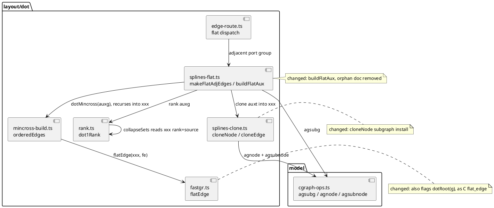

# Component map

```plantuml
@startuml
package "layout/dot" {
  [edge-route.ts\nflat dispatch] --> [splines-flat.ts\nmakeFlatAdjEdges / buildFlatAux] : adjacent port group
  [splines-flat.ts\nmakeFlatAdjEdges / buildFlatAux] --> [splines-clone.ts\ncloneNode / cloneEdge] : clone auxt into xxx
  [splines-flat.ts\nmakeFlatAdjEdges / buildFlatAux] --> [rank.ts\ndot1Rank] : rank auxg
  [rank.ts\ndot1Rank] --> [rank.ts\ndot1Rank] : collapseSets reads xxx rank=source
  [splines-flat.ts\nmakeFlatAdjEdges / buildFlatAux] --> [mincross-build.ts\norderedEdges] : dotMincross(auxg), recurses into xxx
  [mincross-build.ts\norderedEdges] --> [fastgr.ts\nflatEdge] : flatEdge(xxx, fe)
}
package "model" {
  [cgraph-ops.ts\nagsubg / agnode / agsubnode]
}
[splines-flat.ts\nmakeFlatAdjEdges / buildFlatAux] --> [cgraph-ops.ts\nagsubg / agnode / agsubnode] : agsubg
[splines-clone.ts\ncloneNode / cloneEdge] --> [cgraph-ops.ts\nagsubg / agnode / agsubnode] : agnode + agsubnode
note right of [splines-flat.ts\nmakeFlatAdjEdges / buildFlatAux] : changed: buildFlatAux, orphan doc removed
note right of [splines-clone.ts\ncloneNode / cloneEdge] : changed: cloneNode subgraph install
note right of [fastgr.ts\nflatEdge] : changed: also flags dotRoot(g), as C flat_edge
@enduml
```
