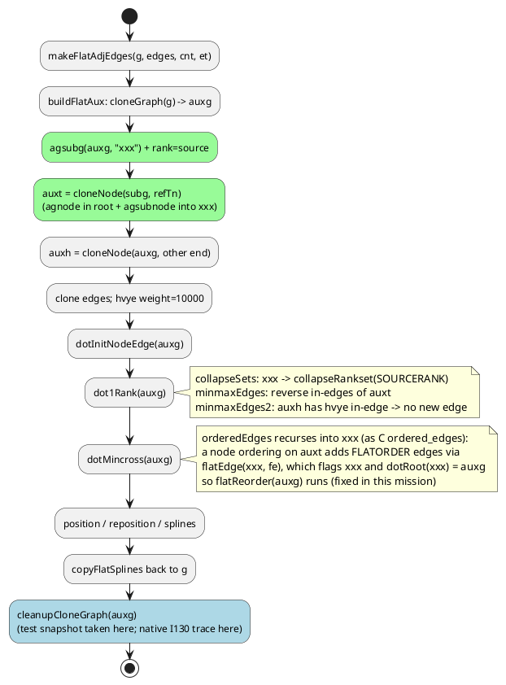

# Data flow: aux graph build and rank (after the change)

```plantuml
@startuml
start
:makeFlatAdjEdges(g, edges, cnt, et);
:buildFlatAux: cloneGraph(g) -> auxg;
#palegreen:agsubg(auxg, "xxx") + rank=source;
#palegreen:auxt = cloneNode(subg, refTn)\n(agnode in root + agsubnode into xxx);
:auxh = cloneNode(auxg, other end);
:clone edges; hvye weight=10000;
:dotInitNodeEdge(auxg);
:dot1Rank(auxg);
note right
  collapseSets: xxx -> collapseRankset(SOURCERANK)
  minmaxEdges: reverse in-edges of auxt
  minmaxEdges2: auxh has hvye in-edge -> no new edge
end note
:dotMincross(auxg);
note right
  orderedEdges recurses into xxx (as C ordered_edges):
  a node ordering on auxt adds FLATORDER edges via
  flatEdge(xxx, fe), which flags xxx and dotRoot(xxx) = auxg
  so flatReorder(auxg) runs (fixed in this mission)
end note
:position / reposition / splines;
:copyFlatSplines back to g;
#lightblue:cleanupCloneGraph(auxg)\n(test snapshot taken here; native I130 trace here);
stop
@enduml
```

Green steps are new. The blue step is where both the port test (AD-4) and the
native trace read the aux ranks.
