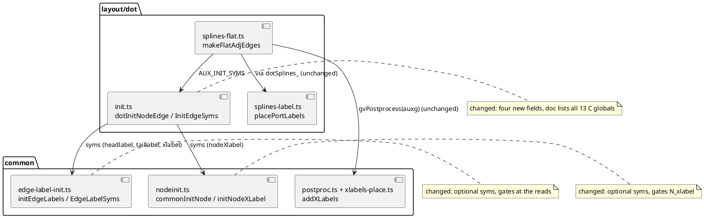

# Component map

```plantuml
@startuml
package "layout/dot" {
  [splines-flat.ts\nmakeFlatAdjEdges] --> [init.ts\ndotInitNodeEdge / InitEdgeSyms] : AUX_INIT_SYMS
  [splines-flat.ts\nmakeFlatAdjEdges] --> [splines-label.ts\nplacePortLabels] : via dotSplines_ (unchanged)
}
package "common" {
  [nodeinit.ts\ncommonInitNode / initNodeXLabel]
  [edge-label-init.ts\ninitEdgeLabels / EdgeLabelSyms]
  [postproc.ts + xlabels-place.ts\naddXLabels]
}
[init.ts\ndotInitNodeEdge / InitEdgeSyms] --> [nodeinit.ts\ncommonInitNode / initNodeXLabel] : syms (nodeXlabel)
[init.ts\ndotInitNodeEdge / InitEdgeSyms] --> [edge-label-init.ts\ninitEdgeLabels / EdgeLabelSyms] : syms (headlabel, taillabel, xlabel)
[splines-flat.ts\nmakeFlatAdjEdges] --> [postproc.ts + xlabels-place.ts\naddXLabels] : gvPostprocess(auxg) (unchanged)
note right of [init.ts\ndotInitNodeEdge / InitEdgeSyms] : changed: four new fields, doc lists all 13 C globals
note right of [edge-label-init.ts\ninitEdgeLabels / EdgeLabelSyms] : changed: optional syms, gates at the reads
note right of [nodeinit.ts\ncommonInitNode / initNodeXLabel] : changed: optional syms, gates N_xlabel
@enduml
```
