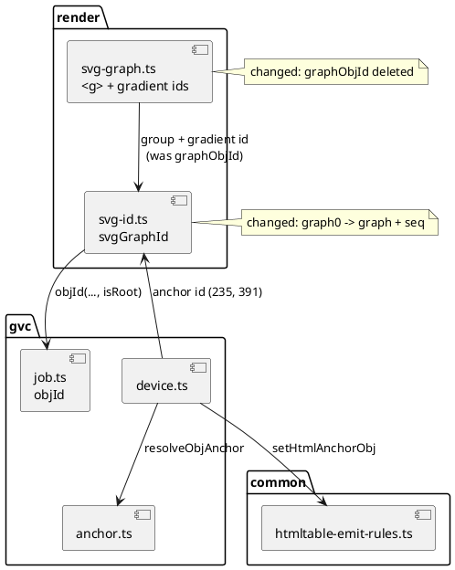

# Component map

```plantuml
@startuml
package "render" {
  [svg-id.ts\nsvgGraphId] as id
  [svg-graph.ts\n<g> + gradient ids] as svg
}
package "gvc" {
  [device.ts] as dev
  [anchor.ts] as anc
  [job.ts\nobjId] as job
}
package "common" {
  [htmltable-emit-rules.ts] as html
}
dev --> id : anchor id (235, 391)
svg --> id : group + gradient id\n(was graphObjId)
id --> job : objId(..., isRoot)
dev --> anc : resolveObjAnchor
dev --> html : setHtmlAnchorObj
note right of id : changed: graph0 -> graph + seq
note right of svg : changed: graphObjId deleted
@enduml
```
