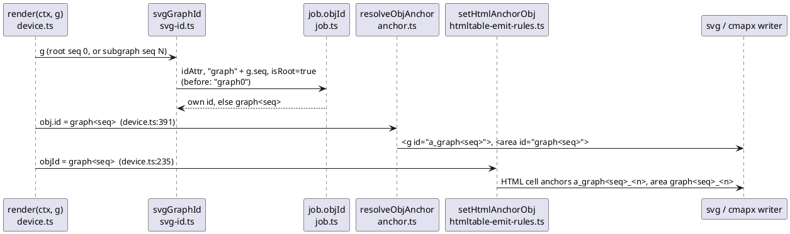

# Data flow: the graph's object id

```plantuml
@startuml
participant "render(ctx, g)\ndevice.ts" as dev
participant "svgGraphId\nsvg-id.ts" as id
participant "job.objId\njob.ts" as job
participant "resolveObjAnchor\nanchor.ts" as anc
participant "setHtmlAnchorObj\nhtmltable-emit-rules.ts" as html
participant "svg / cmapx writer" as out

dev -> id : g (root seq 0, or subgraph seq N)
id -> job : idAttr, "graph" + g.seq, isRoot=true\n(before: "graph0")
job --> id : own id, else graph<seq>
dev -> anc : obj.id = graph<seq>  (device.ts:391)
anc -> out : <g id="a_graph<seq>">, <area id="graph<seq>">
dev -> html : objId = graph<seq>  (device.ts:235)
html -> out : HTML cell anchors a_graph<seq>_<n>, area graph<seq>_<n>
@enduml
```
