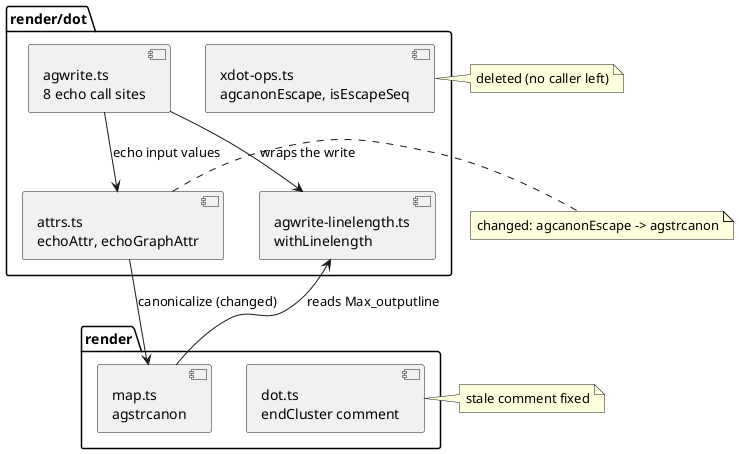

# Component map

```plantuml
@startuml
package "render/dot" {
  [agwrite.ts\n8 echo call sites] as aw
  [attrs.ts\nechoAttr, echoGraphAttr] as attrs
  [xdot-ops.ts\nagcanonEscape, isEscapeSeq] as xo
  [agwrite-linelength.ts\nwithLinelength] as ll
}
package "render" {
  [map.ts\nagstrcanon] as map
  [dot.ts\nendCluster comment] as dot
}
aw --> attrs : echo input values
attrs --> map : canonicalize (changed)
aw --> ll : wraps the write
map --> ll : reads Max_outputline
note right of attrs : changed: agcanonEscape -> agstrcanon
note right of xo : deleted (no caller left)
note right of dot : stale comment fixed
@enduml
```
