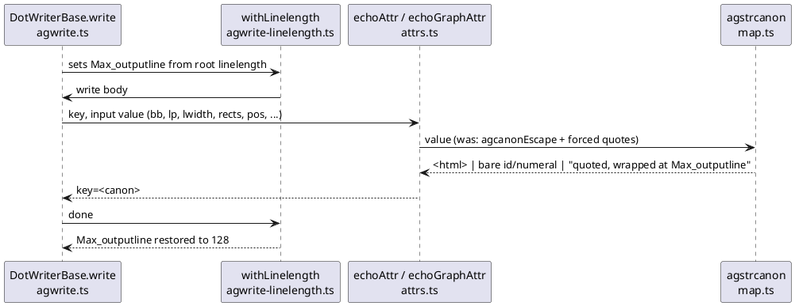

# Data flow: an echoed attribute value

Proposed (after T1).

```plantuml
@startuml
participant "DotWriterBase.write\nagwrite.ts" as w
participant "withLinelength\nagwrite-linelength.ts" as ll
participant "echoAttr / echoGraphAttr\nattrs.ts" as echo
participant "agstrcanon\nmap.ts" as canon

w -> ll : sets Max_outputline from root linelength
ll -> w : write body
w -> echo : key, input value (bb, lp, lwidth, rects, pos, ...)
echo -> canon : value (was: agcanonEscape + forced quotes)
canon --> echo : <html> | bare id/numeral | "quoted, wrapped at Max_outputline"
echo --> w : key=<canon>
w -> ll : done
ll --> w : Max_outputline restored to 128
@enduml
```
