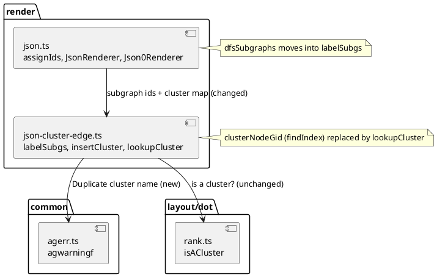

# Component map

```plantuml
@startuml
package "render" {
  [json.ts\nassignIds, JsonRenderer, Json0Renderer] as json
  [json-cluster-edge.ts\nlabelSubgs, insertCluster, lookupCluster] as jce
}
package "common" {
  [agerr.ts\nagwarningf] as agerr
}
package "layout/dot" {
  [rank.ts\nisACluster] as rank
}
json --> jce : subgraph ids + cluster map (changed)
jce --> rank : is a cluster? (unchanged)
jce --> agerr : Duplicate cluster name (new)
note right of jce : clusterNodeGid (findIndex) replaced by lookupCluster
note right of json : dfsSubgraphs moves into labelSubgs
@enduml
```
