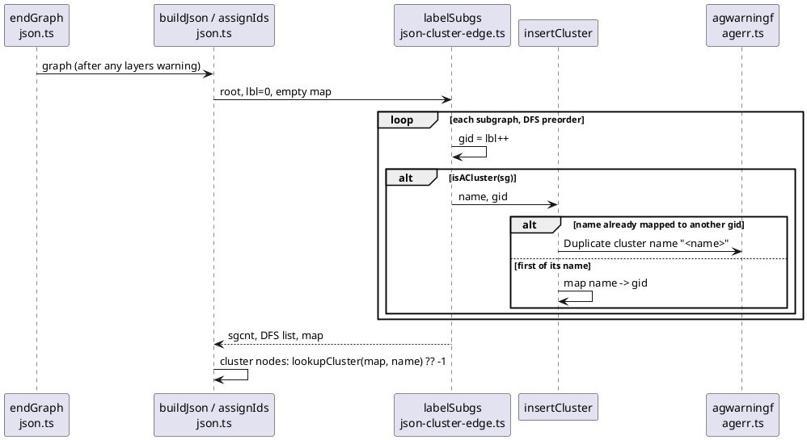

# Data flow: one json render's ids and the warning

Proposed (after T1).

```plantuml
@startuml
participant "endGraph\njson.ts" as eg
participant "buildJson / assignIds\njson.ts" as ai
participant "labelSubgs\njson-cluster-edge.ts" as ls
participant "insertCluster" as ins
participant "agwarningf\nagerr.ts" as w

eg -> ai : graph (after any layers warning)
ai -> ls : root, lbl=0, empty map
loop each subgraph, DFS preorder
  ls -> ls : gid = lbl++
  alt isACluster(sg)
    ls -> ins : name, gid
    alt name already mapped to another gid
      ins -> w : Duplicate cluster name "<name>"
    else first of its name
      ins -> ins : map name -> gid
    end
  end
end
ls --> ai : sgcnt, DFS list, map
ai -> ai : cluster nodes: lookupCluster(map, name) ?? -1
@enduml
```
