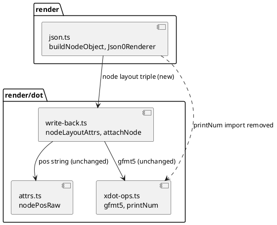

# Component map

```plantuml
@startuml
package "render" {
  [json.ts\nbuildNodeObject, Json0Renderer] as json
}
package "render/dot" {
  [write-back.ts\nnodeLayoutAttrs, attachNode] as wb
  [attrs.ts\nnodePosRaw] as attrs
  [xdot-ops.ts\ngfmt5, printNum] as ops
}
json --> wb : node layout triple (new)
wb --> attrs : pos string (unchanged)
wb --> ops : gfmt5 (unchanged)
json ..> ops : printNum import removed
@enduml
```
