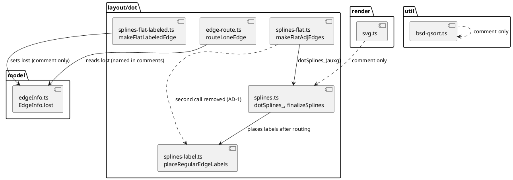

# Component map

```plantuml
@startuml
package "layout/dot" {
  [splines-flat.ts\nmakeFlatAdjEdges] as flat
  [splines.ts\ndotSplines_, finalizeSplines] as spl
  [splines-label.ts\nplaceRegularEdgeLabels] as lbl
  [splines-flat-labeled.ts\nmakeFlatLabeledEdge] as fl
  [edge-route.ts\nrouteLoneEdge] as lone
}
package "model" {
  [edgeInfo.ts\nEdgeInfo.lost] as ei
}
package "render" {
  [svg.ts] as svg
}
package "util" {
  [bsd-qsort.ts] as q
}
flat --> spl : dotSplines_(auxg)
spl --> lbl : places labels after routing
flat ..> lbl : second call removed (AD-1)
fl --> ei : sets lost (comment only)
lone --> ei : reads lost (named in comments)
svg ..> spl : comment only
q ..> q : comment only
@enduml
```
