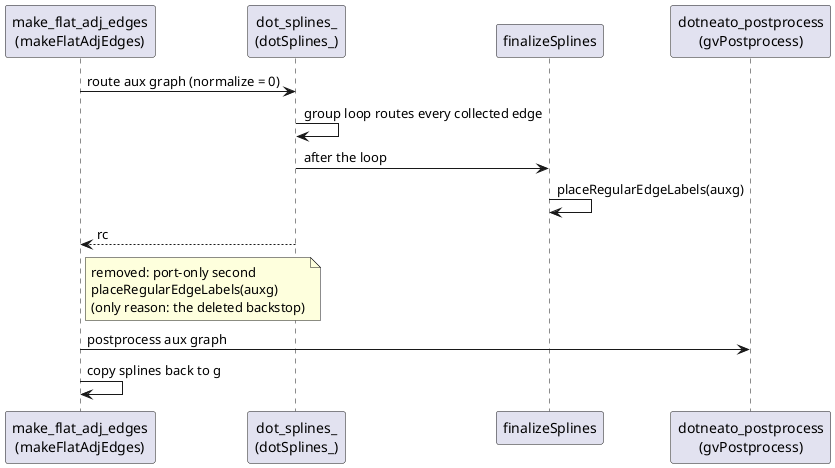

# Data flow: the flat-adjacent aux graph, C vs port

Proposed state after AD-1. The removed port-only step is shown as a note.

```plantuml
@startuml
participant "make_flat_adj_edges\n(makeFlatAdjEdges)" as m
participant "dot_splines_\n(dotSplines_)" as s
participant "finalizeSplines" as f
participant "dotneato_postprocess\n(gvPostprocess)" as p
m -> s : route aux graph (normalize = 0)
s -> s : group loop routes every collected edge
s -> f : after the loop
f -> f : placeRegularEdgeLabels(auxg)
s --> m : rc
note right of m
  removed: port-only second
  placeRegularEdgeLabels(auxg)
  (only reason: the deleted backstop)
end note
m -> p : postprocess aux graph
m -> m : copy splines back to g
@enduml
```
