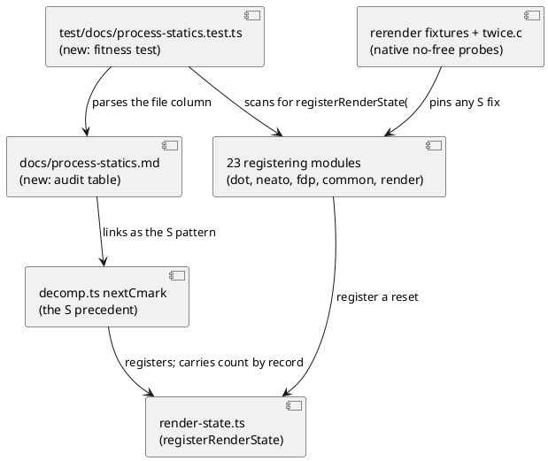

# Component map

```plantuml
@startuml
component "render-state.ts\n(registerRenderState)" as RS
component "23 registering modules\n(dot, neato, fdp, common, render)" as Mods
component "decomp.ts nextCmark\n(the S precedent)" as Cm
component "docs/process-statics.md\n(new: audit table)" as Doc
component "test/docs/process-statics.test.ts\n(new: fitness test)" as Fit
component "rerender fixtures + twice.c\n(native no-free probes)" as Fx

Mods --> RS : register a reset
Cm --> RS : registers; carries count by record
Fit --> Mods : scans for registerRenderState(
Fit --> Doc : parses the file column
Doc --> Cm : links as the S pattern
Fx --> Mods : pins any S fix
@enduml
```
