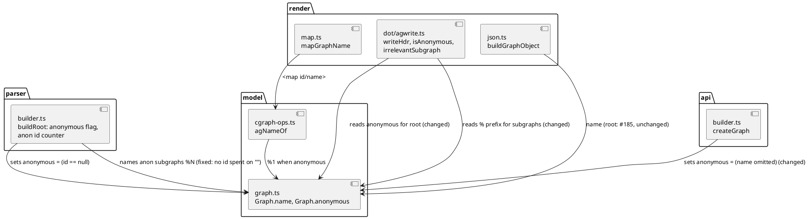

# Component map

```plantuml
@startuml
package "parser" {
  [builder.ts\nbuildRoot: anonymous flag,\nanon id counter] as pb
}
package "api" {
  [builder.ts\ncreateGraph] as ab
}
package "model" {
  [graph.ts\nGraph.name, Graph.anonymous] as g
  [cgraph-ops.ts\nagNameOf] as ops
}
package "render" {
  [dot/agwrite.ts\nwriteHdr, isAnonymous,\nirrelevantSubgraph] as aw
  [map.ts\nmapGraphName] as map
  [json.ts\nbuildGraphObject] as js
}
pb --> g : sets anonymous = (id == null)
pb --> g : names anon subgraphs %N (fixed: no id spent on "")
ab --> g : sets anonymous = (name omitted) (changed)
aw --> g : reads anonymous for root (changed)
aw --> g : reads % prefix for subgraphs (changed)
map --> ops : <map id/name>
ops --> g : %1 when anonymous
js --> g : name (root: #185, unchanged)
@enduml
```
