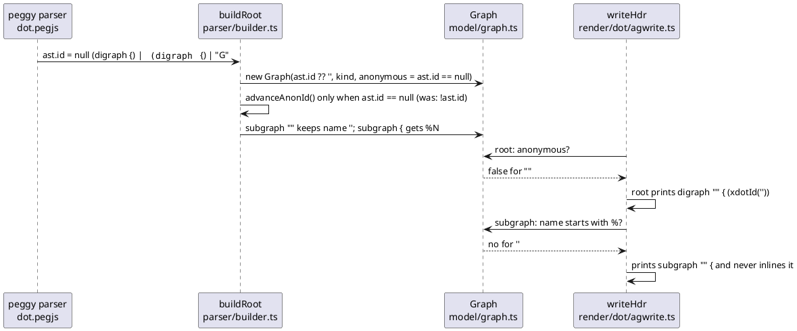

# Data flow: a graph name from DOT text to the dot header

Proposed (after T1).

```plantuml
@startuml
participant "peggy parser\ndot.pegjs" as p
participant "buildRoot\nparser/builder.ts" as b
participant "Graph\nmodel/graph.ts" as g
participant "writeHdr\nrender/dot/agwrite.ts" as w

p -> b : ast.id = null (digraph {) | "" (digraph "" {) | "G"
b -> g : new Graph(ast.id ?? '', kind, anonymous = ast.id == null)
b -> b : advanceAnonId() only when ast.id == null (was: !ast.id)
b -> g : subgraph "" keeps name ''; subgraph { gets %N
w -> g : root: anonymous?
g --> w : false for ""
w -> w : root prints digraph "" { (xdotId(''))
w -> g : subgraph: name starts with %?
g --> w : no for ''
w -> w : prints subgraph "" { and never inlines it
@enduml
```
