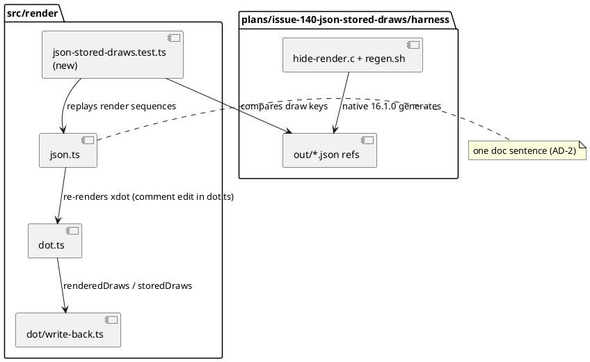

# Component map: issue #140

Proposed (after T1). Comment-only edits are marked; no behaviour changes.

```plantuml
@startuml
package "src/render" {
  [json.ts] as json
  [dot.ts] as dot
  [dot/write-back.ts] as wb
  [json-stored-draws.test.ts\n(new)] as t
}
package "plans/issue-140-json-stored-draws/harness" {
  [hide-render.c + regen.sh] as h
  [out/*.json refs] as refs
}
json --> dot : re-renders xdot (comment edit in dot.ts)
dot --> wb : renderedDraws / storedDraws
t --> json : replays render sequences
t --> refs : compares draw keys
h --> refs : native 16.1.0 generates
note right of json : one doc sentence (AD-2)
@enduml
```
