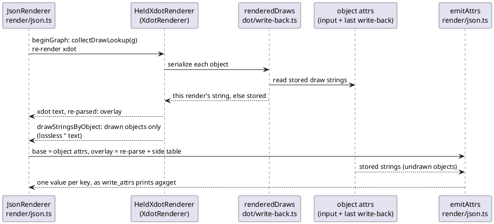

# Data flow: where `-Tjson`'s draw strings come from

Current (unchanged by this mission).

```plantuml
@startuml
participant "JsonRenderer\nrender/json.ts" as j
participant "HeldXdotRenderer\n(XdotRenderer)" as x
participant "renderedDraws\ndot/write-back.ts" as r
participant "object attrs\n(input + last write-back)" as a
participant "emitAttrs\nrender/json.ts" as e

j -> x : beginGraph: collectDrawLookup(g)\nre-render xdot
x -> r : serialize each object
r -> a : read stored draw strings
r --> x : this render's string, else stored
x --> j : xdot text, re-parsed: overlay
x --> j : drawStringsByObject: drawn objects only\n(lossless " text)
j -> e : base = object attrs, overlay = re-parse + side table
a --> e : stored strings (undrawn objects)
e --> j : one value per key, as write_attrs prints agxget
@enduml
```
