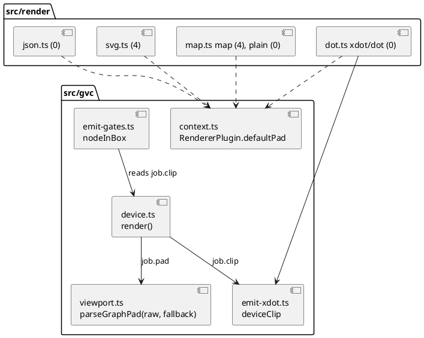

# Component map

```plantuml
@startuml
package "src/gvc" {
  [context.ts\nRendererPlugin.defaultPad] as CTX
  [viewport.ts\nparseGraphPad(raw, fallback)] as VP
  [device.ts\nrender()] as DEV
  [emit-xdot.ts\ndeviceClip] as CLIP
  [emit-gates.ts\nnodeInBox] as GATE
}
package "src/render" {
  [svg.ts (4)] as SVG
  [dot.ts xdot/dot (0)] as DOT
  [json.ts (0)] as JSON
  [map.ts map (4), plain (0)] as MAP
}
SVG ..> CTX
DOT ..> CTX
JSON ..> CTX
MAP ..> CTX
DEV --> VP : job.pad
DEV --> CLIP : job.clip
DOT --> CLIP
GATE --> DEV : reads job.clip
@enduml
```
