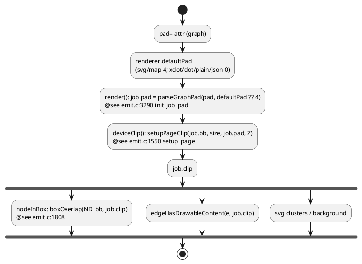

# Data flow: pad → clip → node gate

```plantuml
@startuml
start
:pad= attr (graph);
:renderer.defaultPad\n(svg/map 4; xdot/dot/plain/json 0);
:render(): job.pad = parseGraphPad(pad, defaultPad ?? 4)\n@see emit.c:3290 init_job_pad;
:deviceClip(): setupPageClip(job.bb, size, job.pad, Z)\n@see emit.c:1550 setup_page;
:job.clip;
fork
  :nodeInBox: boxOverlap(ND_bb, job.clip)\n@see emit.c:1808;
fork again
  :edgeHasDrawableContent(e, job.clip);
fork again
  :svg clusters / background;
end fork
stop
@enduml
```

Before the fix: `nodeInBox` read `job.bb ± job.pad` with the pad always 4, and
`deviceClip` re-derived the pad from `renderer.type`.
