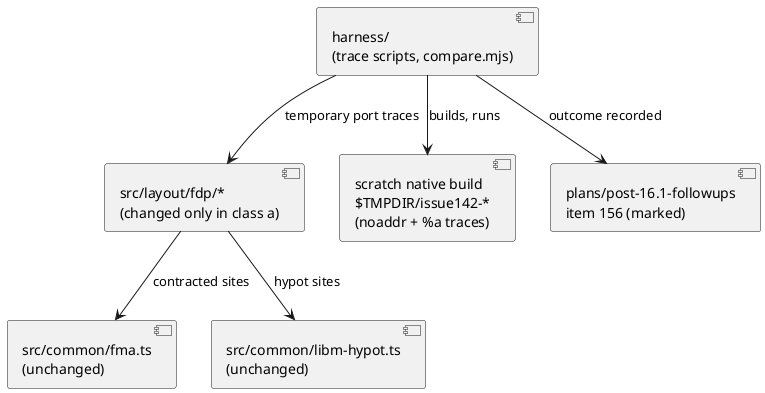

# Component map

```plantuml
@startuml
component "src/layout/fdp/*\n(changed only in class a)" as fdp
component "src/common/fma.ts\n(unchanged)" as fma
component "src/common/libm-hypot.ts\n(unchanged)" as hyp
component "scratch native build\n$TMPDIR/issue142-*\n(noaddr + %a traces)" as nat
component "harness/\n(trace scripts, compare.mjs)" as har
component "plans/post-16.1-followups\nitem 156 (marked)" as fu
fdp --> fma : contracted sites
fdp --> hyp : hypot sites
har --> nat : builds, runs
har --> fdp : temporary port traces
har --> fu : outcome recorded
@enduml
```
