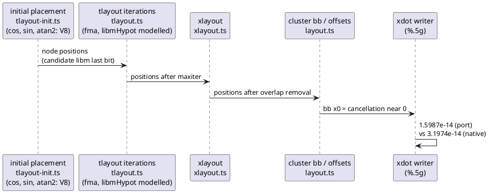

# Data flow: how a last bit reaches clusterA's bb x0

```plantuml
@startuml
participant "initial placement\ntlayout-init.ts\n(cos, sin, atan2: V8)" as init
participant "tlayout iterations\ntlayout.ts\n(fma, libmHypot modelled)" as tl
participant "xlayout\nxlayout.ts" as xl
participant "cluster bb / offsets\nlayout.ts" as bb
participant "xdot writer\n(%.5g)" as out

init -> tl : node positions\n(candidate libm last bit)
tl -> xl : positions after maxiter
xl -> bb : positions after overlap removal
bb -> out : bb x0 = cancellation near 0
out -> out : 1.5987e-14 (port)\nvs 3.1974e-14 (native)
@enduml
```

T1 bisects these boundaries left to right; the first differing arrow names the
phase to trace statement by statement.
