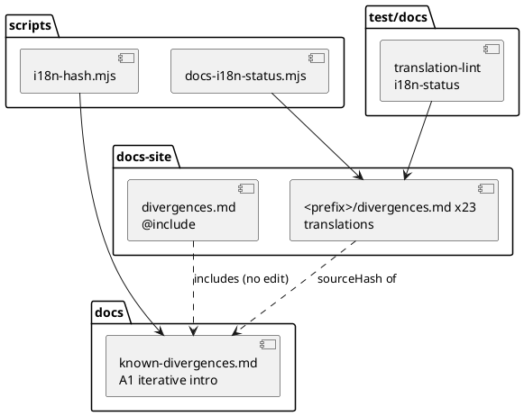

# Component map

```plantuml
@startuml
package "docs" {
  [known-divergences.md\nA1 iterative intro] as en
}
package "docs-site" {
  [divergences.md\n@include] as inc
  [<prefix>/divergences.md x23\ntranslations] as loc
}
package "scripts" {
  [i18n-hash.mjs] as hash
  [docs-i18n-status.mjs] as st
}
package "test/docs" {
  [translation-lint\ni18n-status] as t
}
inc ..> en : includes (no edit)
loc ..> en : sourceHash of
hash --> en
st --> loc
t --> loc
@enduml
```
