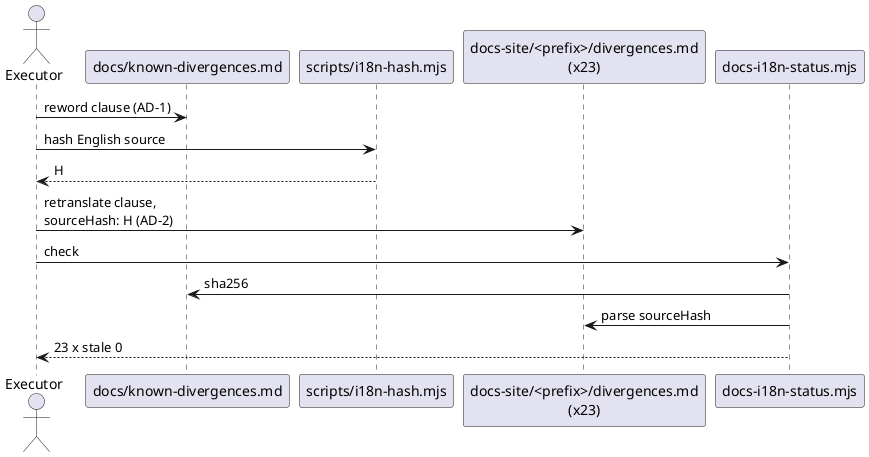

# Data flow

```plantuml
@startuml
actor Executor
participant "docs/known-divergences.md" as en
participant "scripts/i18n-hash.mjs" as hash
participant "docs-site/<prefix>/divergences.md\n(x23)" as loc
participant "docs-i18n-status.mjs" as status
Executor -> en : reword clause (AD-1)
Executor -> hash : hash English source
hash --> Executor : H
Executor -> loc : retranslate clause,\nsourceHash: H (AD-2)
Executor -> status : check
status -> en : sha256
status -> loc : parse sourceHash
status --> Executor : 23 x stale 0
@enduml
```
