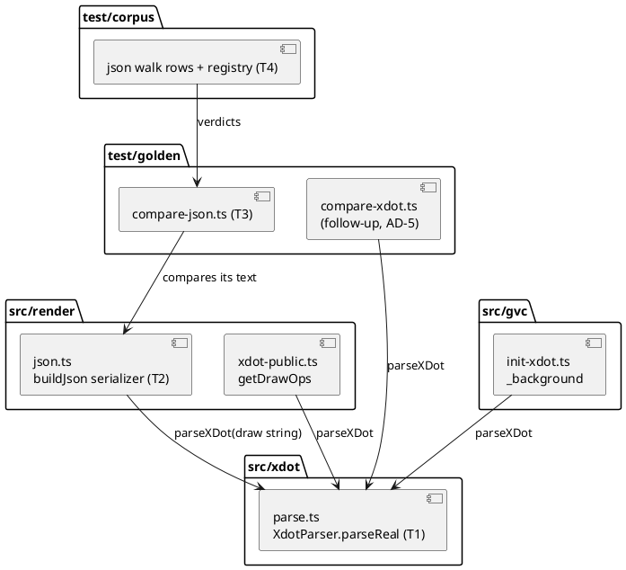

# Component map

```plantuml
@startuml
package "src/xdot" {
  [parse.ts\nXdotParser.parseReal (T1)] as P
}
package "src/render" {
  [json.ts\nbuildJson serializer (T2)] as J
  [xdot-public.ts\ngetDrawOps] as G
}
package "src/gvc" {
  [init-xdot.ts\n_background] as I
}
package "test/golden" {
  [compare-json.ts (T3)] as C
  [compare-xdot.ts\n(follow-up, AD-5)] as X
}
package "test/corpus" {
  [json walk rows + registry (T4)] as R
}
J --> P : parseXDot(draw string)
G --> P : parseXDot
I --> P : parseXDot
X --> P : parseXDot
R --> C : verdicts
C --> J : compares its text
@enduml
```
