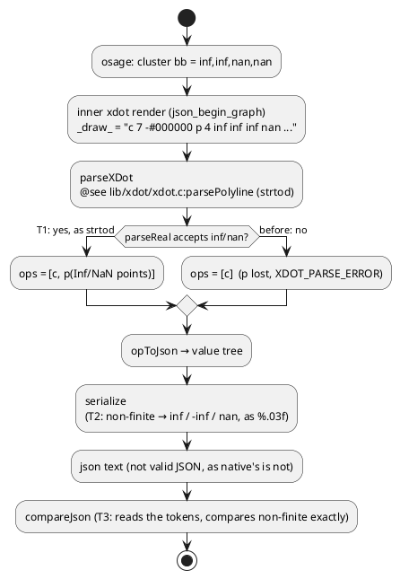

# Data flow: cluster bb → json `_draw_`

```plantuml
@startuml
start
:osage: cluster bb = inf,inf,nan,nan;
:inner xdot render (json_begin_graph)\n_draw_ = "c 7 -#000000 p 4 inf inf inf nan ...";
:parseXDot\n@see lib/xdot/xdot.c:parsePolyline (strtod);
if (parseReal accepts inf/nan?) then (T1: yes, as strtod)
  :ops = [c, p(Inf/NaN points)];
else (before: no)
  :ops = [c]  (p lost, XDOT_PARSE_ERROR);
endif
:opToJson → value tree;
:serialize\n(T2: non-finite → inf / -inf / nan, as %.03f);
:json text (not valid JSON, as native's is not);
:compareJson (T3: reads the tokens, compares non-finite exactly);
stop
@enduml
```
