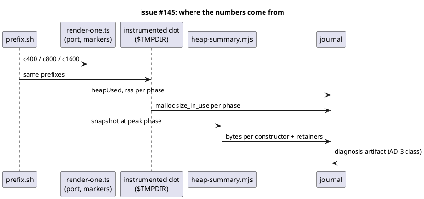
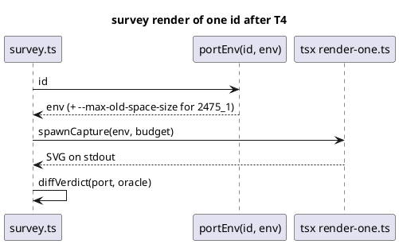

# Data flow: measurement and the capped survey render

```plantuml
@startuml
title issue #145: where the numbers come from
participant "prefix.sh" as P
participant "render-one.ts\n(port, markers)" as R
participant "instrumented dot\n($TMPDIR)" as N
participant "heap-summary.mjs" as H
participant "journal" as J
P -> R : c400 / c800 / c1600
P -> N : same prefixes
R -> J : heapUsed, rss per phase
N -> J : malloc size_in_use per phase
R -> H : snapshot at peak phase
H -> J : bytes per constructor + retainers
J -> J : diagnosis artifact (AD-3 class)
@enduml
```

```plantuml
@startuml
title survey render of one id after T4
participant "survey.ts" as S
participant "portEnv(id, env)" as E
participant "tsx render-one.ts" as R
S -> E : id
E --> S : env (+ --max-old-space-size for 2475_1)
S -> R : spawnCapture(env, budget)
R --> S : SVG on stdout
S -> S : diffVerdict(port, oracle)
@enduml
```
